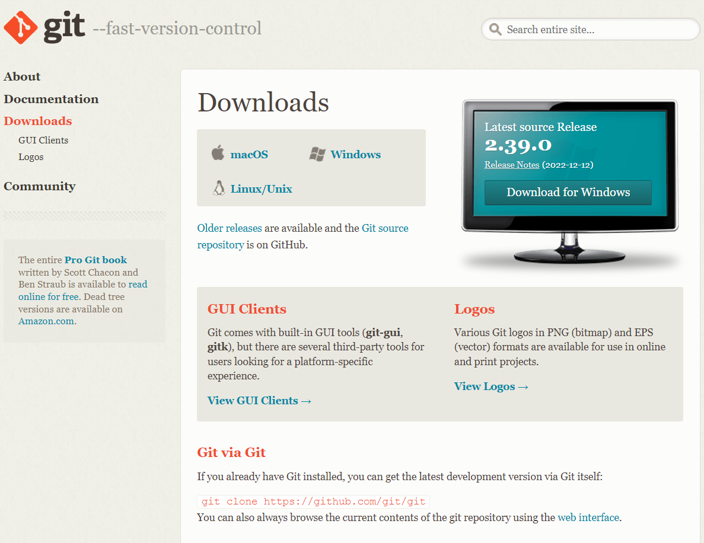
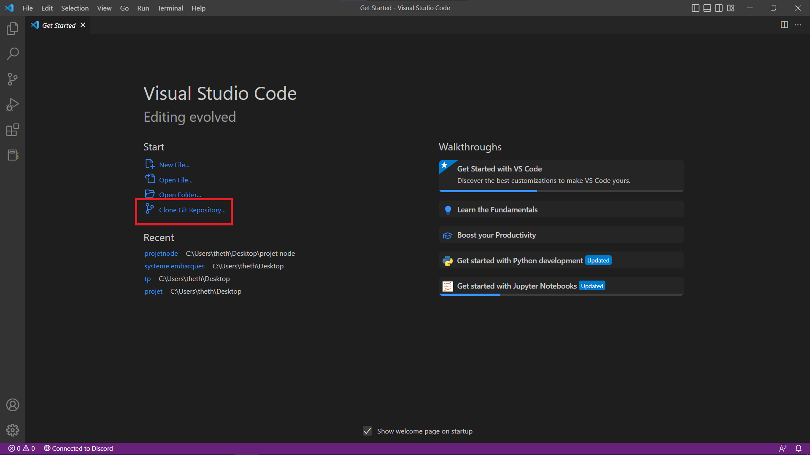

 

# Projet API - NodeJS 

## Introduction au projet

Participants : Théophile RABUT / __theofow__, Anis MAOUCHE / __anismch__, Anaïs MFABOUM / __anetanya__

Notre projet consiste en la création d'une API en utilisant le language __nodejs__. Ce language est un environnement de temps d'execution issu de JavaScript, très efficace pour le __backend__ d'une application.

Dans le cadre de notre projet, nous allons nous servir de ce language afin de concevoir une API d'un __annulaire__, permettant de récupérer les coordonées d'une personne en entrant un nom / prénom. 

## Précisions 

Voici quelques précisions à prendre en compte dans le cadre de ce projet :

>- Notre groupe travaille sous __Windows__ uniquement.
>- Le projet utilise les _paquets npm_ __express__ et __nodemon__

# Mise en place de l'environnement

Dans un premier temps, il est nécessaire de mettre en place l'environnement dans lequel nous allons travailler.

Nous allons utiliser ici `git` et `node`.

## Installation de 


- Télécharger git 

L'installation peut s'effectuer sur internet via [ce lien](https://git-scm.com/downloads).

 

Une fois le téléchargement terminé, procéder à l'installation.

- Initialiser Git sur VSCode

Pour commencer, il faut cloner le repository github sur l'ordinateur utilisé.

 

Entrez la clé __HTTP__ du repository.

## Installation de 

### Windows/MacOS

- Télécharger Node

Node peut s'installer sur internet via [ce lien](https://nodejs.org/en/download/).

### Linux
```sh
curl -fsSL https://deb.nodesource.com/setup_18.x | sudo -E bash -

sudo apt-get install -y nodejs
```

# Prérequis

BDD etc

# Comment utiliser l'API